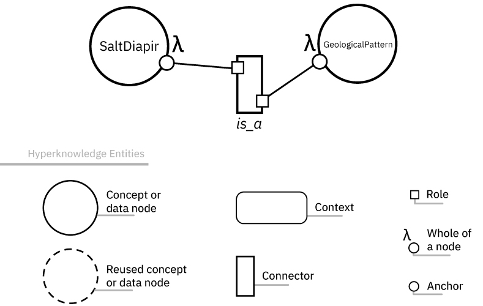
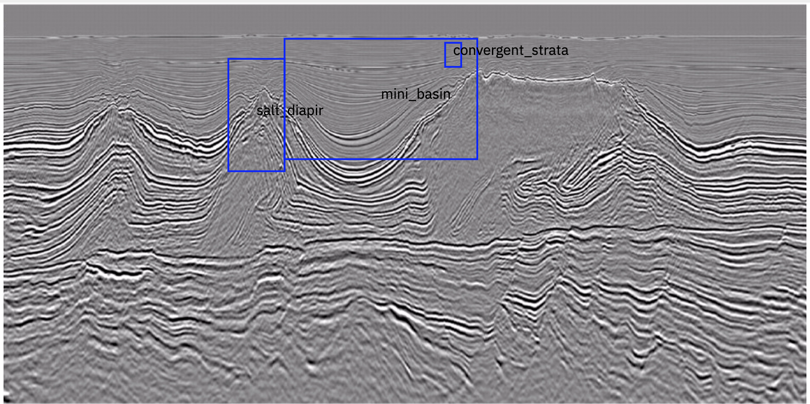
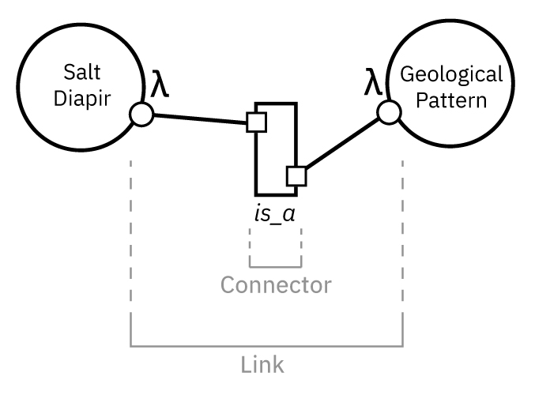
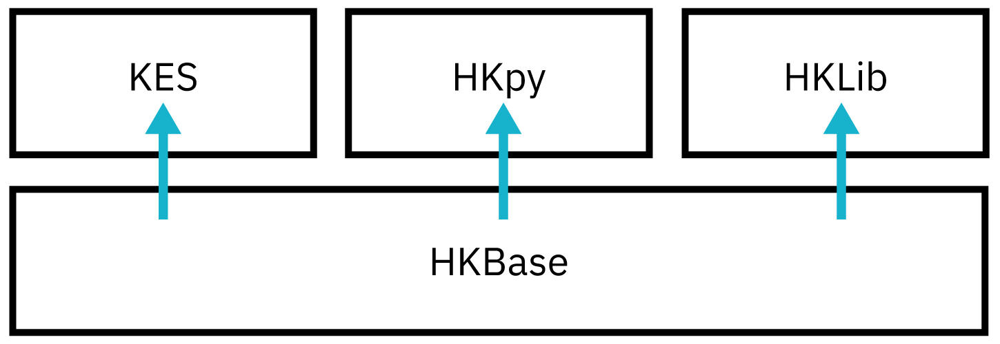
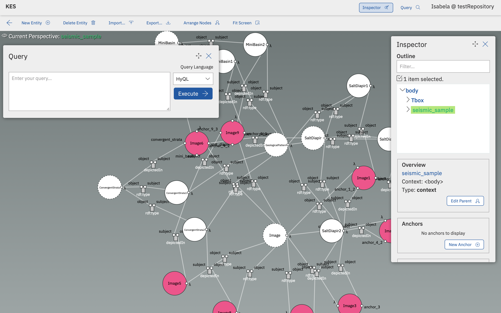

# Hyperknowledge Library (HKLib)

Javascript library that implements the core Hyperknowledge constructs used by Hyperknowledge Base (HKBase) service. The main purpose of this library is to serve as an API for NodeJS developers that want to use Hyperknowledge within their own applications and interact with HKBases programatically.

## What is Hyperknowledge?
  
IBM Hyperlinked Knowledge, or Hyperknowledge, for short, is a framework that provides mechanisms to represent high-level semantic concepts and unstructured data in the same knowledge representation. By semantic concepts we mean abstract descriptions regarding linked data, such as facts about subjects or specialized knowledge from a given domain formally described by ontologies. By unstructured data we mean raw data, such as image, audio, text, video (multimedia content), machine learning models, programs (executable content) or source codes, to name a few.

### An Introduction

Traditional knowledge graphs are too low-level and static. They rely on plain nodes and edges to describe data objects and facts, usually assuming a fixed theory of knowledge representation. Due to the lack of structuring elements in their data models, in traditional knowledge graphs it is hard to represent entities at different levels of abstraction or to combine multiple knowledge and reasoning paradigms in the same representation. Particularly troublesome are the representation of context, time, change, and general computation, which are still considered open challenges by the research community [[Bonatti-P-A-2018](http://drops.dagstuhl.de/opus/volltexte/2019/10328/pdf/dagrep_v008_i009_p029_18371.pdf), [Noy-N-2019](https://dl.acm.org/doi/pdf/10.1145/3331166?download=true)].

  
An IBM Hyperlinked Knowledge Graph (HKG, or Hyperknowledge graph), is a knowledge graph in the sense that it is a graph-based model for combining multimodal data and knowledge at scale. But an HKG goes beyond traditional knowledge graphs in at least three aspects:
  

* First, HKGs adopt a recursive hypergraph data model endowed with a powerful type system. This permits the direct representation of complex structures, such as n-ary relationships (edges connecting to more than two nodes), compositions (recursive nodes), and higher-order relationships (edges connecting to edges). The HKG type system defines the valid ways in which these structures can be combined and guarantees that the graph is consistent at all times.  

* Furthermore, the HKG does not prescribe the kinds of data and knowledge that can be represented in it, nor does it enforce specific semantics (interpretation). As such, the HKG can be instantiated according to specific representational needs. Predefined instantiations are provided via profiles, such as the SROIQ+MM profile for describing multimedia data through SROIQ formulas (the formal underpinning OWL 2 DL).

* Finally, HKGs allow for "smart" graph representations by embedding computations in them. These computations can be triggered explicitly or implicitly (due to specific configurations of the graph) and can operate over data, knowledge, or other computations. They can be used to define structures that, for example, capture change and evolution within the graph, enhance the deductive power of the logical theory (operating as rules), or execute specific tasks at specific times (for instance, ML tasks for pattern recognition while ingesting data or evaluating queries).

### The Basics

 Hyperknowledge has four basic elements for representing knowledge: **nodes**, **links**, **connectors**, and **contexts**. A domain in which Hyperknowledge can be useful is that of geology, and this is the representation of a simple fact in that domain (a salt diapir is a geological pattern):


<center>



</center>

  
A node is the basic unit of information, which represents an entity. In this case, both "Salt Diapir" and "Geological Pattern" are concept nodes. A node's fragments, that is, segments of a nodes' information are called anchors. Examples of anchors are a region of interest in an image or a clip in a video. They act as markers for referencing those portions of data. In this example, the only anchor these two nodes have is the one that represents them as a whole. However, here is an example of anchors in media (for instance, in a seismic image featuring geological patterns):

  

<center>



</center>

  
Connectors and links establish relations between anchors of nodes. Connectors define the semantics of a relation, as well as their structure indicating which roles are assigned to each node involved. Links, on the other hand, define relationships - they are instances of a given relation. In Hyperknowledge, links represent N-ary relationships among entities through their anchors.

  

<center>



</center>
  

Finally, Hyperknowledge favors compositionality by means of contexts, which are containers for other entities – including other contexts, recursively – allowing a hierarchical organization of data, as well as grouping entities and relationships.

### Requirements to use Hyperknowledge
</br>

To use Hyperknowledge and its features, you have to access a HKBase - a hybrid database system based on Hyperknowledge. HKBase has been designed to use Hyperknowledge as both its internal data model and for external APIs. With an HKBase, you will be able to manage data and retrieve information.

Three different tools can be used for accessing an HKBase: the Knowledge Explorer System (KES), the HKLib, and the [HKpy]((https://github.com/ibm-hyperknowledge/hkpy.git)).

<center>



</center>

The KES is a UI that showcases a graphical representation of the data stored in the HKBase. Besides visualisation, the KES allows users to curate the knowledge represented in the base (by creating, removing, or updating entities and/or relationships, and organizing knowledge) and offers a query interface for knowledge retrieval.

<center>



</center>

HKLib is a NodeJS library that allows access to all HKBase functionalities via JavaScript code.
[HKpy](https://github.com/ibm-hyperknowledge/hkpy.git) allows you to do the same, but via Python code.


## Installation

To use HKLib in your NodeJS project, you can install using:
```
npm install hklib
```

## Usage 
To include HKLib on your js file and use its features, you can do as follows:
```js 
const HKLib = require("hklib");
```

### Connecting to HKBase

To have access to HKBase, you will have to create a datasource object. First, you have to include the HKLib class for datasources, HKDatasource. After including the HKDatasource class to your file, you can use the following method to create a datasource connected to a HKBase in a specific repository (you may need an authentication token):

```js
const HKDatasource = HKLib.HKDatasource;
let datasource = new HKDatasource("<HKBase's URL, repository's name>", token);
```
 For example:
```js
let datasource = new HKDatasource("https://hkbase-dev.mybluemix.net/", "testRepository", "exampleToken");
```
It receives as parameters the base URL of the HKBase, the name of a repository and an authentication token. The repository may or may not exist - in case it does, the datasource will be connected to the informed repository and every operation will be performed on this repository. In case the repository does not exist, the datasource object can be used to create the informed repository, as the next topic will show.

### Create new repository

Once the name of a repository is defined in the datasource object, you can call the following method to create this repository:
```js
let datasource = new HKDatasource("https://hkbase-dev.mybluemix.net/", "testRepository", token);
datasource.createRepository((err,  data) =>
{
	if(!err)
	{
		callback(datasource.graphName);
	}
	else
	{
        	callback(err);
	}
});
``` 
Once the operation is concluded, whether it was successful or not, a callback function will be invoked with the informed parameter. 

### Get all repositories

If you have a datasource object connected to a HKBase, you can get a list with all the repositories on that base with the following method:
```js
datasource.getRepositories((err, data) =>
{
	if(!err)
	{
	    	//data is a list with all repositories currently on HKBase
		callback(data);
	}
	else
	{
		callback(err);
	}
});
```
If the operation is successful, a callback function will be invoked with the list of repositories as a parameter.


### Delete repository
To delete a repository, the datasource object has to be connected to the repository that you want to drop. For example:
```js
let datasource = new HKDatasource("https://hkbase-dev.mybluemix.net/", "testRepository", token);
datasource.dropRepository((err,  data) =>
{
	if(!err)
	{
		callback(datasource.graphName);
	}
	else
	{
		callback(err);
	}
});
```

### Managing entities

HKLib supports several operations with entities, such as creating entities (contexts, nodes, links), adding them to a repository, retrieving entities, and removing them. The following sections will explain each of these functionalities.

#### Create a Context
To create a new context, you have to include the HKLib class for Contexts to your file. After that, you can use the following method to create a context:
```js
const  Context  =  HKLib.Context;
let context = new Context("Name of Context");
```
The example above creates a context in the root of your repository. If you want to insert a context inside of an existing context, you have to put the name of the existing context besides the name of the new context. For example, let's create the context Geological Structures, and them create a new context Salt Diapir, inserting it inside of the "Geological Structures" context.
```js
let context1 = new Context("GeologicalStructures");
let context2 = new Context("SaltDiapir",context1.id);
```
The name of an entity is called its **id**. Id's should not contain spaces, and should be unique.

#### Create a Node

To create a node using HKLib, you have to include the HKLib class for Nodes to your file.
```js
const  Node  =  HKLib.Node;
```
Then, before creating any entity or adding it to HKBase, it is important to create an array to store these entities.  
```js
let  entities  = [];
```
After that, you can use the following method to create a
 node:
```js
let n1 = new Node("Name of node", "Context in which the node will be inserted");
```
For example, let's create a simple node:
```js
let n1 = new Node("SaltDiapir", null);
```
Before assigning a node to a context, the context has to already exist.  For example, we created the context *GeographicPatterns*, now I am going to add the node *SaltDiapir* to this context.

```js
let n1 = new Node("SaltDiapir", "GeographicPatterns");
//you can either write the name of the context or use the context.id
let n = new Node("SaltDiapir", context.id);
entities.push(n1.serialize());
```
For example, let's create a simple node:
```js
let n1 = new Node("SaltDiapir", null);
entities.push(n1.serialize());
```
After creating a node, you have to add this node to the entities array, and serialize the entity you just created - this will convert it from object to Hyperknowledge format, which will be ready to be added to HKBase. To add any type of entity on Hyperknowledge to HKBase, you will have to use the datasource object. 

```js
datasource.addEntities(entities,  (err,  data) =>
{
	if(!err)
	{
		//Include your code here
	}
	else
	{
		console.log(err);
	}
});
```

## Build

From version 4.x.x onwards, HKLib has started to accept Typescript code. Therefore, if you want to use and collaborate with the source code, you will need to compile the project to generate the javascript files that will be added to the `dist` folder:

```
npm run build
```
